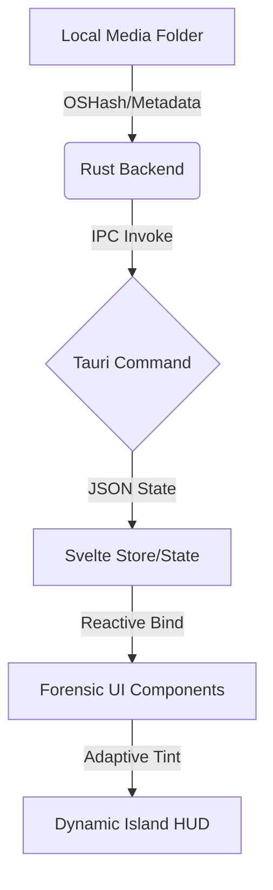

# Flux Player: System Architecture

This document describes the "Data Highway" of Flux Player—from disk files to cinematic UI.

## 1. The Core Stack
- **Frontend**: Svelte 5 (State management via `$state` and `$effect`).
- **Backend**: Rust (Tauri 2.0) for filesystem access, metadata scraping, and window management.
- **Styles**: Vanilla CSS (Cyber Dark design system).

## 2. The Data Highway (Disk -> UI)

## 3. Component Hierarchy
- `+layout.svelte`: Global container, imports `app.css`.
- `Titlebar.svelte`: Frameless drag region and window controls.
- `DynamicIsland.svelte`: Central UX hub (Status).
- `DiscoveryHub`: (Upcoming) Grid-based media library.
- `DetailPanel`: (Upcoming) Glassmorphism side-drawer for media info.

## 4. Key Logic Layers
- **Adaptive Tinting**: Extracting vibrant colors from posters to tint the `Dynamic Island` border.
- **Clipboard Intercept**: Monitoring the clipboard for media URLs to trigger the "Rapid Stream" flow.
- **Zero-Latency Search**: Frontend-heavy fuzzy filtering for instant library results.

---
*Next focus: Implementing the Discovery Hub grid system.*
